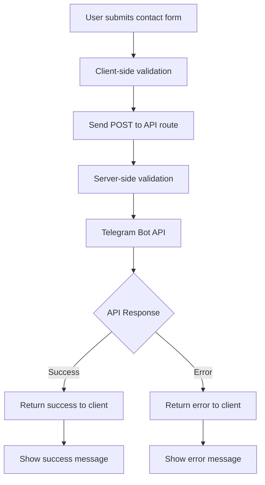

# Contact Page Telegram Integration Plan

## Overview
This plan outlines the implementation of Telegram bot integration for the contact form on the ecommerce website. When users submit the contact form, their information will be validated and forwarded to a Telegram bot.

## Architecture



## Environment Variables

Add to `.env`:
```
TELEGRAM_BOT_TOKEN=8798953142:AAHkFGT8KUTFDNgTeUPeBybRlZGMH0uhM1I
TELEGRAM_CHAT_ID=<your-chat-id>
```

Add to `.env.example`:
```
TELEGRAM_BOT_TOKEN=
TELEGRAM_CHAT_ID=
```

## Implementation Steps

### Step 1: Update ContactSchema (lib/schemas.ts)
- Remove `subject` and `orderNumber` fields to match current form
- Keep: firstName, lastName, email, phone, message

### Step 2: Create API Route (app/api/contact/route.ts)
- Accept POST requests
- Validate incoming data server-side using Zod
- Send formatted message to Telegram Bot API
- Handle errors gracefully
- Return appropriate JSON responses

### Step 3: Update Contact Form (app/contact/page.tsx)
- Modify `onSubmit` to call API route
- Add error handling for failed requests
- Add loading state management
- Display user-friendly success/error messages
- Ensure token is never exposed in client code

## Telegram Message Format

```
📬 New Contact Form Submission
━━━━━━━━━━━━━━━━━━━━━━━━━━━━━━

👤 Name: [FirstName LastName]
📧 Email: [email]
📱 Phone: [phone or "Not provided"]
💬 Message:
[message]

━━━━━━━━━━━━━━━━━━━━━━━━━━━━━━
🕐 Submitted: [timestamp]
```

## Security Considerations

1. Bot token stored ONLY in server-side environment variables
2. No client-side exposure of sensitive data
3. Server-side validation as final validation gate
4. Input sanitization before sending to Telegram

## Error Handling

| Scenario | Client Message | HTTP Status |
|----------|----------------|-------------|
| Invalid input | "Please check your form inputs" | 400 |
| Telegram API fail | "Unable to send message. Please try again." | 502 |
| Server error | "Something went wrong. Please try again later." | 500 |
| Success | "Message sent successfully!" | 200 |
